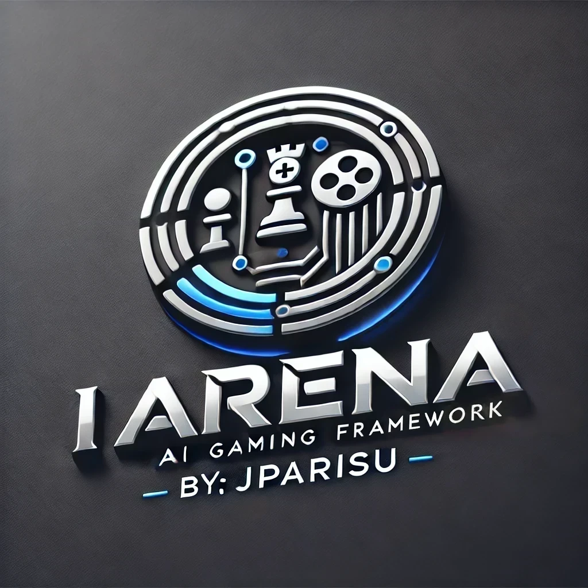

# IArena Documentation

{ width="320" }

**IArena** is an open-source Python framework for building turn-based games, creating players, and running matches in terminal or Streamlit frontends.

## Overview

The project is designed for educational and research workflows in computer science and artificial intelligence. It focuses on a clean architecture where:

- `Rules` define game logic,
- `Position` define game state,
- `Movement` define state transitions,
- `Player` implementations decide actions,
- `Arena` implementations orchestrate game loop,
- `ScoreBoard` reports outcomes.

## Goal

IArena makes it easy to experiment with strategies, heuristics, and algorithms across multiple games while keeping reproducibility and extension points explicit.

## Library Status

The current codebase uses the `iarena` package namespace and modular domains:

- `iarena.gaming`: game abstractions and built-in games
- `iarena.playing`: player abstractions and implementations
- `iarena.arening`: arena orchestration and policies
- `iarena.visualizing`: terminal and Streamlit views
- `iarena.apps`: end-user terminal and Streamlit applications
- `iarena.grading`: automated match/trial/exam evaluation helpers
- `iarena.utilizing`: shared utility modules

Repository: <https://github.com/jparisu/IArena>

## Next Steps

- [Installation](installation.md)
- [Getting Started](getting-started.md)
- [User Guide](user/games/games.md)
- [API Reference](api/index.md)
