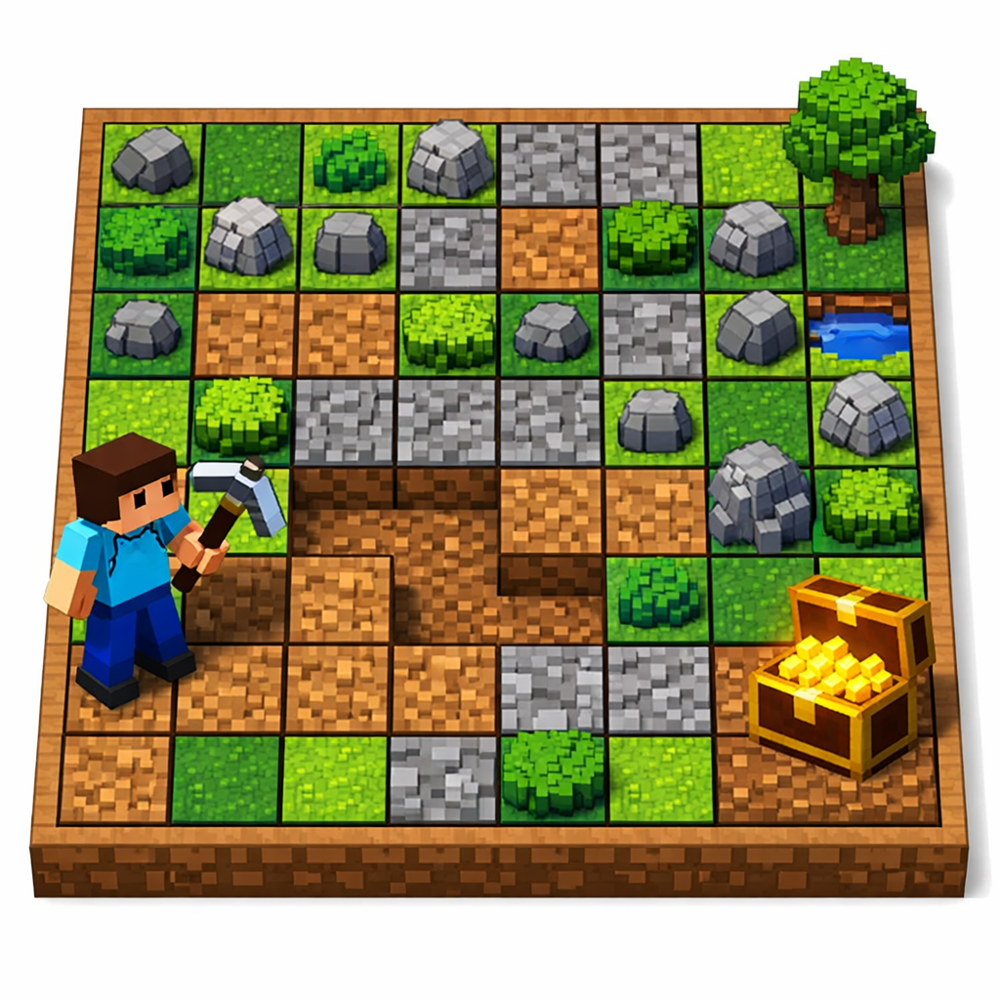

# GoldMine



**GoldMine** is an exploration game implemented in the IArena framework as a single-player game. The player navigates a square map, digs tiles by moving across the grid, and attempts to discover the hidden target while minimizing the total accumulated digging cost.

# 1. Game Description

## Objective

Reach the hidden **target tile** by moving across the map and digging tiles. The goal is to find the target while accumulating the **lowest possible total cost**.

Depending on the configuration, the game can also expose optional heuristic hints to guide exploration:

* **Compass hint**: suggests the cardinal direction of the target.
* **Proximity hint**: gives the Manhattan distance to the target.
* **Density hint**: returns a heuristic value associated with the current tile.

## Players

This game is a search 1-player game, where the player explores the map step by step until the target tile is reached.

## Scoring

The score is based on exploration cost:

```text
score = -accumulated_cost
```

Lower total digging cost produces a higher score.

## Import

```python
from iarena.gaming.goldmine import GoldMineConfiguration, GoldMinePosition, GoldMineMovement, GoldMineRules
```

---

# 2. Configuration (`GoldMineConfiguration`)

`GoldMineConfiguration` defines the static parameters of the GoldMine map, generation process, and optional heuristics.

| Attribute              | Type                 | Description                                                                   |                                                                                       |
| ---------------------- | -------------------- | ----------------------------------------------------------------------------- | ------------------------------------------------------------------------------------- |
| `n_rows`               | `int`                | Number of rows in the map. Default is `6`.                                    |                                                                                       |
| `n_cols`               | `int`                | Number of columns in the map. Default is `6`.                                 |                                                                                       |
| `start`                | `SquareMapCoordinate | None`                                                                         | Optional explicit starting coordinate. Default is `None`, which resolves to `(0, 0)`. |
| `target`               | `SquareMapCoordinate | None`                                                                         | Optional explicit target coordinate. If omitted, a random valid target is generated.  |
| `map_data`             | `list[list[float]]   | None`                                                                         | Optional explicit map cost matrix. If omitted, the map is generated automatically.    |
| `map_generator`        | `str`                | Name of the generator used when `map_data` is absent. Default is `"uniform"`. |                                                                                       |
| `map_generator_params` | `dict[str, Any]`     | Additional keyword arguments passed to the map generator.                     |                                                                                       |
| `integer`              | `bool`               | Whether generated map values are rounded to integers. Default is `False`.     |                                                                                       |
| `seed`                 | `int                 | None`                                                                         | Optional random seed used for target placement and map generation.                    |
| `compass_activated`    | `bool`               | Enables compass hints. Default is `False`.                                    |                                                                                       |
| `proximity_activated`  | `bool`               | Enables proximity hints. Default is `False`.                                  |                                                                                       |
| `density_activated`    | `bool`               | Enables density hints. Default is `False`.                                    |                                                                                       |
| `heuristic_map_data`   | `list[list[float]]   | None`                                                                         | Optional explicit heuristic-density map used when density hints are activated.        |

## Example Setup

```python
from iarena.utilizing.mapping.square_map.SquareMapCoordinate import SquareMapCoordinate

configuration = GoldMineConfiguration(
    n_rows=6,
    n_cols=6,
    start=SquareMapCoordinate(0, 0),
    target=SquareMapCoordinate(5, 5),
    map_generator="uniform",
    seed=0,
    compass_activated=True,
    proximity_activated=False,
    density_activated=False,
)
```

For a more detailed explanation on how maps are generated, check the [map generation documentation](../../user/games/squaremap.md).

---

# 3. Core Components

This game follows the abstractions defined in [Game Overview](games.md): **Rules**, **Position**, and **Movement**.


## 3.1 SquareMapDirection

`SquareMapDirection` is an enumeration that defines the four cardinal directions used for movement on a square grid: **UP**, **RIGHT**, **DOWN**, and **LEFT**. It is used by GoldMine and other grid-based games to represent valid movement directions in a consistent and type-safe way.

### Values

| Value | Delta | Description |
| ----- | ----- | ----------- |
| `UP` | `(-1, 0)` | Moves one row upward. |
| `RIGHT` | `(0, 1)` | Moves one column to the right. |
| `DOWN` | `(1, 0)` | Moves one row downward. |
| `LEFT` | `(0, -1)` | Moves one column to the left. |

### Methods and Properties

| Method / Property | Return Type | Description |
| ----------------- | ----------- | ----------- |
| `delta` | `tuple[int, int]` | Returns the coordinate variation `(dx, dy)` associated with the direction. |
| `opposite()` | `SquareMapDirection` | Returns the opposite cardinal direction. |

### Example

```python
from iarena.utilizing.mapping.square_map.SquareMapDirection import SquareMapDirection

direction = SquareMapDirection.RIGHT

print(direction.delta)         # (0, 1)
print(direction.opposite())    # SquareMapDirection.LEFT
```


## 3.2 GoldMinePosition

`GoldMinePosition` represents the current exploration state visible to the player.

### Attributes

This game's position do not expose any public attributes, as main state information is secret for the player.
Instead, all relevant information is accessed through methods.

### Methods

| Method                               | Return Type                                  | Description                                                               |
| ------------------------------------ | -------------------------------------------- | ------------------------------------------------------------------------- |
| `next_player()`                      | `PlayerIndex`                                | Always returns `PlayerIndex(0)` because GoldMine is a single-player game. |
| `get_rules()`                        | `GoldMineRules`                              | Returns the rules instance associated with the position.                  |
| `get_compass()`                      | `SquareMapDirection`                         | Returns the compass hint toward the target when enabled.                  |
| `get_proximity()`                    | `int`                                        | Returns the Manhattan-distance hint to the target when enabled.           |
| `get_density()`                      | `float`                                      | Returns the density-map hint for the current tile when enabled.           |
| `get_valid_directions()`             | `Iterator[SquareMapDirection]`               | Yields all legal movement directions from the current coordinate.         |
| `get_cost_from_direction(direction)` | `float`                                      | Returns the movement cost of stepping in the given direction.             |
| `get_directions_with_cost()`         | `Iterator[tuple[SquareMapDirection, float]]` | Yields all valid directions together with their cost.                     |
| `hash()`                             | `int`                                        | Returns a deterministic hash of the current position.                     |
| `get_current_cost()`                 | `float`                                      | Returns the total accumulated cost of dug tiles.                          |

```python
position = rules.first_position()

compass_direction = position.get_compass()              # Requires compass_activated=True
proximity = position.get_proximity()                    # Requires proximity_activated=True
directions = list(position.get_valid_directions())      # Valid directions from current tile
costs = list(position.get_directions_with_cost())       # Directions with corresponding costs

directions_and_costs = position.get_directions_with_cost()
for direction, cost in directions_and_costs:
    # Access each valid direction and its cost
    ...
```

---

## 3.3 GoldMineMovement

`GoldMineMovement` represents one move in a cardinal direction.

### Attributes

| Attribute   | Type                 | Description                               |
| ----------- | -------------------- | ----------------------------------------- |
| `direction` | `SquareMapDirection` | Cardinal direction selected for the move. |

```python
move = GoldMineMovement(direction=SquareMapDirection.RIGHT)
```

!!! note
    Not every movement may be legal from a given position.
    Always check the list of valid directions before applying a movement.

---

## 3.4 GoldMineRules

`GoldMineRules` is the rules manager for the game and implements the `Rules` interface described in `games.md`.

### Methods

| Method                    | Description                                                                            |
| ------------------------- | -------------------------------------------------------------------------------------- |
| `n_players()`             | Returns `1`.                                                                           |
| `first_position()`        | Creates the initial state at the start coordinate, with the start tile already dug.    |
| `possible_movements(pos)` | Generates all legal cardinal moves from the current position.                          |
| `next_position(pos, mov)` | Applies a movement and returns the successor position with the new tile marked as dug. |
| `is_finished(pos)`        | Returns `True` when the target tile has been dug.                                      |
| `get_score(pos)`          | Returns a `ScoreBoard` containing the negative accumulated digging cost for player 0.  |

```python
rules = GoldMineRules(configuration)
position = rules.first_position()                       # Initial position at the start tile
movements = list(rules.possible_movements(position))    # Legal moves from the current state
valid_movement = move in movements                      # Check whether a move is legal
next_position = rules.next_position(position, move)     # Apply one movement
finished = rules.is_finished(next_position)             # Check whether the target was reached
scoreboard = rules.get_score(next_position)             # Get current score
```

## Hints and Heuristics

### Compass

If `compass_activated` is `True`, the position provides a compass hint indicating the approximate cardinal direction of the target from the current tile. The hint is returned as a `SquareMapDirection` value.
This is calculate as:

``` python
dx = to_coord.x - from_coord.x
dy = to_coord.y - from_coord.y
if abs(dx) >= abs(dy):
    return SquareMapDirection.DOWN if dx > 0 else SquareMapDirection.UP
return SquareMapDirection.RIGHT if dy > 0 else SquareMapDirection.LEFT
```

### Proximity

If `proximity_activated` is `True`, the position provides a proximity hint indicating the **Manhattan distance** from the current tile to the target.

### Density

If `density_activated` is `True`, the position provides a density hint based on the value of the current tile in the `heuristic_map_data`.
Lower density values tends to indicate tiles that are heuristically closer to the target, while higher values indicate tiles that are heuristically farther from the target.
However, there is no fixed formula to generate this heuristic, so it would only be a rough guide for exploration.

---

# 4. Notes on Representation

* The playable area is a **square-grid map** represented internally as a `SquareMap[float]`.
* The player position is tracked as a `SquareMapCoordinate`.
* Dug tiles are stored as a set of coordinate tuples `(x, y)`.
* The starting tile is always considered dug in the initial position.
* A movement is legal if the selected direction remains **within map bounds**.
* Movement cost is determined by the value of the destination tile.
* Revisiting an already dug tile has cost `0.0`.
* The game finishes as soon as the **target tile** belongs to the dug set.
* The final score is the negative sum of all dug tile costs, including the tiles visited on the successful path.

---

# 5. Implementation Example: Random Player

The following example shows a complete simulation using a random movement strategy.

```python
from iarena.arening import ArenaFactory
from iarena.gaming.goldmine import GoldMineConfiguration, GoldMineRules
from iarena.playing import PolyvalentRandomPlayer
from iarena.visualizing import EmptyView

# Initialize configuration for a 6x6 generated map
config = GoldMineConfiguration(
    n_rows=6,
    n_cols=6,
    seed=0,
    compass_activated=True,
    proximity_activated=False,
    density_activated=False,
)

# Create rules instance
rules = GoldMineRules(config)

# Create a random player
player1 = PolyvalentRandomPlayer("random-bot", seed=0)  # Set a seed for reproducibility
players = [player1]

# Create an arena to play the game
arena = ArenaFactory.create_arena(
    rules=rules,
    view=EmptyView(),  # Modify this view to visualize the game state if desired
    players=players,
    max_turns=200,     # Set a maximum number of turns to prevent infinite loops
)

# Play the game and get the final score
scoreboard = arena.play(rules=rules, players=players)
print(f"Final score: {scoreboard.get_score(0)}")
```
