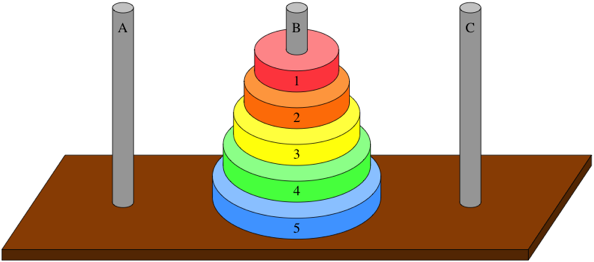

# Tower of Hanoi



The **Tower of Hanoi** is a classic mathematical puzzle implemented in the IArena framework as a single-player game. The player must move a stack of disks from a starting peg to a target peg while minimizing the number of moves.

# 1. Game Description

## Objective

Move all disks from their initial peg positions to the **last peg**, while respecting the following constraints:

* **Single move**: Only one disk can be moved at a time.
* **Stacking rule**: A disk can only be placed on an empty peg or on top of a larger disk.
* **Top-only rule**: Only the top-most disk of a peg can be moved.

Try to reach the goal state in the fewest moves possible.

## Players

This game is a search 1-player game, where the player is trying to find the optimal sequence of moves to solve the puzzle.

## Scoring

The score is based on movement efficiency:

```text
score = -steps
```

Fewer steps produce a higher score.

## Import

```python
from iarena.gaming.hanoi import HanoiConfiguration, HanoiPosition, HanoiMovement, HanoiRules
```


---


# 2. Configuration (`HanoiConfiguration`)

`HanoiConfiguration` defines the static parameters of the puzzle.

| Attribute | Type        | Description                                                                  |
| --------- | ----------- | ---------------------------------------------------------------------------- |
| `n_pegs`  | `int`       | Total number of pegs. Must be at least 2.                                    |
| `disks`   | `list[int]` | Initial peg index for each disk. Index `0` corresponds to the smallest disk. |

## Example Setup

```python
# 3 pegs, 3 disks, all starting on peg 0
configuration = HanoiConfiguration(n_pegs=3, disks=[0, 0, 0])
```


---


# 3. Core Components

This game follows the abstractions defined in [Game Overview](games.md): **Rules**, **Position**, and **Movement**.

## 3.1 HanoiPosition

`HanoiPosition` represents the game state at a specific turn.

### Attributes

| Attribute | Type        | Description                      |
| --------- | ----------- | -------------------------------- |
| `n_pegs`  | `int`       | Total number of pegs.            |
| `disks`   | `list[int]` | Current peg index of each disk.  |
| `steps`   | `int`       | Number of moves executed so far. |

### Methods

| Method          | Return Type   | Description                                                            |
| --------------- | ------------- | ---------------------------------------------------------------------- |
| `next_player()` | `PlayerIndex` | Always returns `PlayerIndex(0)` because Hanoi is a single-player game. |
| `get_rules()`   | `HanoiRules`  | Returns the rules instance associated with the position.               |

```python
position = rules.first_position()

n_pegs = position.n_pegs    # Total number of pegs
disks = position.disks      # Current peg index for each disk
disk0 = disks[0]            # Peg index of the smallest disk
steps = position.steps      # Number of moves executed so far
```

---

## 3.2 HanoiMovement

`HanoiMovement` represents a move of the top-most disk from one peg to another.

### Attributes

| Attribute  | Type  | Description            |
| ---------- | ----- | ---------------------- |
| `from_peg` | `int` | Origin peg index.      |
| `to_peg`   | `int` | Destination peg index. |

```python
move = HanoiMovement(from_peg=0, to_peg=2)  # Move top disk from peg 0 to peg 2
```

---

## 3.3 HanoiRules

`HanoiRules` is the rules manager for the game and implements the `Rules` interface described in `games.md`.

### Methods

| Method                    | Description                                              |
| ------------------------- | -------------------------------------------------------- |
| `n_players()`             | Returns `1`.                                             |
| `first_position()`        | Creates the initial state from `HanoiConfiguration`.     |
| `possible_movements(pos)` | Generates all legal moves from the current state.        |
| `next_position(pos, mov)` | Applies a move and increments the step counter.          |
| `is_finished(pos)`        | Returns `True` when all disks are on the last peg.       |
| `get_score(pos)`          | Returns a `ScoreBoard` containing `-steps` for player 0. |

```python
rules = position.get_rules()                # Get the rules instance from the position
movements = list(rules.possible_movements(position))  # Get legal moves from the current position
valid_movement = move in movements          # Check if a specific move is legal
```


---


# 4. Notes on Representation

* Each disk is identified by its index in the `disks` list.
* Smaller indices represent smaller disks.
* The value stored for each disk is the peg where that disk is currently located.
* A valid move must preserve the ordering rule that no larger disk may rest on top of a smaller one.


---


# 5. Implementation Example: Random Player

The following example shows a complete simulation using a random movement strategy.

```python
from iarena.arening import ArenaFactory
from iarena.gaming.hanoi import HanoiConfiguration, HanoiRules, HanoiTerminalView
from iarena.playing import PolyvalentRandomPlayer
from iarena.visualizing import EmptyView
from iarena.gaming.hanoi import HanoiTerminalView

# Initialize configuration with 3 pegs and 3 disks all starting on peg 0
config = HanoiConfiguration(n_pegs=3, disks=[0, 0, 0])

# Create rules instance
rules = HanoiRules(config)

# Create a random player (modify as needed to implement a specific strategy)
player1 = PolyvalentRandomPlayer("random-bot", seed=0) # Set a seed for reproducibility
players = [player1]

# Create an arena to play the game
arena = ArenaFactory.create_arena(
    rules=rules,
    view=EmptyView(),  # Modify this view to visualize the game state if desired
    players=players,   # List of players (in this case, just one)
    max_turns=200,     # Set a maximum number of turns to prevent infinite loops
)

# Play the game and get the final score
scoreboard = arena.play(rules=rules, players=players)
print(f"Final score: {scoreboard.get_score(0)}")
```
