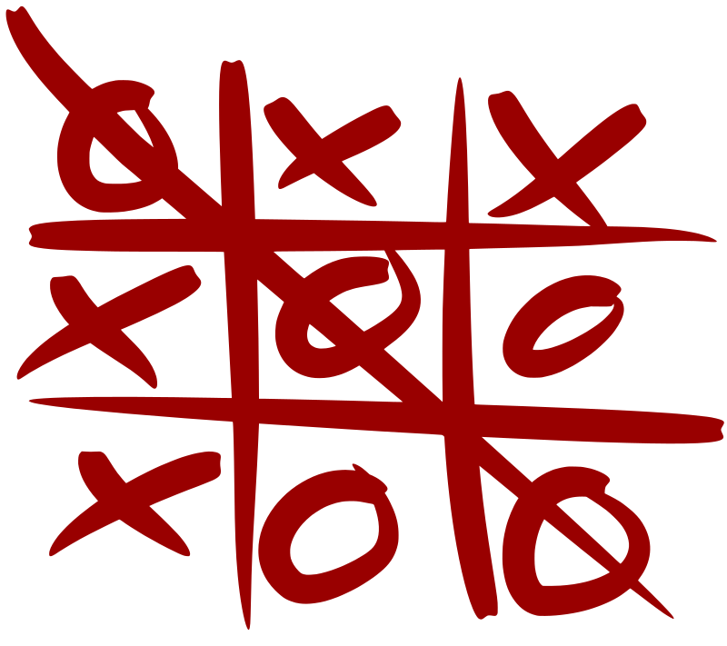

# TicTacToe



TicTacToe is a classic alignment game implemented in the IArena framework as a two-player game. Players alternate turns placing their symbol on the board, and the winner is the first to complete a line of the required length.

# 1. Game Description

## Objective

Be the first player to align the required number of symbols **horizontally, vertically, or diagonally**.

## Players

This game is a deterministic 2-player game with perfect information and zero-sum scoring. Players take turns placing their mark on an empty cell of the board.

## Scoring

The scoring model is outcome-based:

- Winner receives a score of `1.0`.
- Loser receives a score of `-1.0`.
- In case of a draw (no more legal moves and no winner), both players receive a score of `0.0`.

## Import

```python
from iarena.gaming.tictactoe import TicTacToeConfiguration, TicTacToePosition, TicTacToeMovement, TicTacToeRules
```

---

# 2. Configuration (`TicTacToeConfiguration`)

`TicTacToeConfiguration` defines the static parameters of the game.

| Attribute    | Type  | Description                                                         |
| ------------ | ----- | ------------------------------------------------------------------- |
| `board_size` | `int` | Side length of the square board. Default is `3`.                    |
| `win_length` | `int` | Number of aligned symbols required to win. Default is `board_size`. |

## Example Setup

```python
configuration = TicTacToeConfiguration(board_size=3, win_length=3)
```

---

# 3. Core Components

This game follows the abstractions defined in [Game Overview](games.md): **Rules**, **Position**, and **Movement**.

## 3.1 TicTacToePosition

`TicTacToePosition` represents the game state at a specific turn.

### Attributes

| Attribute        | Type               | Description                                 |
| ---------------- | ------------------ | ------------------------------------------- |
| `board_size`     | `int`              | Side length of the square board.            |
| `win_length`     | `int`              | Number of aligned symbols required to win.  |
| `cells`          | `list[int | None]` | Flat row-major representation of the board. |
| `turn`           | `int`              | Number of moves executed so far.            |
| `current_player` | `PlayerIndex`      | Player whose turn it is to move.            |

### Methods

| Method          | Return Type      | Description                                                  |
| --------------- | ---------------- | ------------------------------------------------------------ |
| `next_player()` | `PlayerIndex`    | Returns the player whose turn it is in the current position. |
| `get_rules()`   | `TicTacToeRules` | Returns the rules instance associated with the position.     |

```python
position = rules.first_position()

board_size = position.board_size      # Side length of the board
win_length = position.win_length      # Symbols needed in a line to win
cells = position.cells                # Flat board representation
turn = position.turn                  # Number of moves played so far
current = position.current_player     # Player to move
next_p = position.next_player()       # Same as current player for this position
```

---

## 3.2 TicTacToeMovement

`TicTacToeMovement` represents a move that places a symbol in a board cell.

### Attributes

| Attribute | Type  | Description               |
| --------- | ----- | ------------------------- |
| `row`     | `int` | Row index of the move.    |
| `col`     | `int` | Column index of the move. |

```python
move = TicTacToeMovement(row=1, col=2)  # Place a symbol at row 1, column 2
```

---

## 3.3 TicTacToeRules

`TicTacToeRules` is the rules manager for the game and implements the `Rules` interface described in `games.md`.

### Methods

| Method                    | Description                                                     |
| ------------------------- | --------------------------------------------------------------- |
| `n_players()`             | Returns `2`.                                                    |
| `first_position()`        | Creates the initial empty board from `TicTacToeConfiguration`.  |
| `possible_movements(pos)` | Generates all legal moves from the current state.               |
| `next_position(pos, mov)` | Applies a move and advances the turn to the next player.        |
| `is_finished(pos)`        | Returns `True` when a player has won or no legal moves remain.  |
| `get_score(pos)`          | Returns a `ScoreBoard` with the final outcome for both players. |

```python
configuration = TicTacToeConfiguration(board_size=3, win_length=3)
rules = TicTacToeRules(configuration)

position = rules.first_position()                     # Get the initial position
movements = list(rules.possible_movements(position))  # Get legal moves from the current position
valid_movement = move in movements                    # Check if a specific move is legal
```

---

# 4. Notes on Representation

* The board is stored as a **flat row-major list** in `cells`.
* A board coordinate `(row, col)` maps to the flat index:

```text
row * board_size + col
```

* Cell values are:
    * `None` for an empty cell
    * `0` for player 0
    * `1` for player 1
* A valid move must target an in-bounds and currently empty cell.

---

# 5. Implementation Example: Dummy Player

The following example shows a complete simulation using a simple strategy that always selects the first legal move.

```python
from iarena.arening import ArenaFactory
from iarena.gaming.tictactoe import TicTacToeConfiguration, TicTacToeRules
from iarena.playing import PolyvalentRandomPlayer
from iarena.visualizing import EmptyView

# Initialize configuration with a 3x3 board and a win condition of 3 in a row
config = TicTacToeConfiguration(board_size=3, win_length=3)

# Create rules instance
rules = TicTacToeRules(config)

# Create random players (modify as needed to implement a specific strategy)
player1 = PolyvalentRandomPlayer("random-bot-1", seed=0) # Set a seed for reproducibility
player2 = PolyvalentRandomPlayer("random-bot-2", seed=0) # Set a seed for reproducibility
players = [player1, player2]  # List of players

# Create an arena to play the game
arena = ArenaFactory.create_arena(
    rules=rules,
    view=EmptyView(),  # Modify this view to visualize the game state if desired
    players=players,   # List of players (in this case, just one)
    max_turns=200,     # Set a maximum number of turns to prevent infinite loops
)

# Play the game and get the final score
scoreboard = arena.play(rules=rules, players=players)
print(f"Final score: {scoreboard.get_score(0)}")
print(f"  Player 1 {players[0].name()}: {scoreboard.get_score(0)}")
print(f"  Player 2 {players[1].name()}: {scoreboard.get_score(1)}")
```
